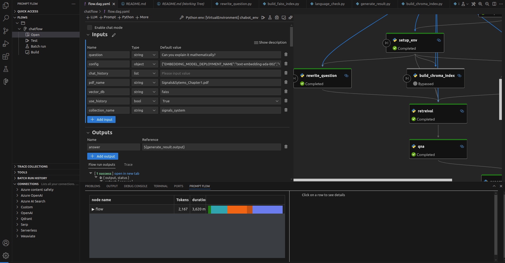

# Chatflow Setup Guide

Welcome to the Chatflow project! This guide will help you set up the project on your local machine.

## Prerequisites

Before you begin, ensure you have the following software installed:

- *Ubuntu >= 20.04*
- *Python 3.x*
- *Git*
- *Visual Studio Code (VS Code)*

## Step 1: Clone the Repository

First, clone the Chatflow repository to your local machine:

```bash
git clone https://github.com/Kedharkb/chatflow.git  <br>
cd chatflow
```
## Step 2: Set Up Python Virtual Environment

Install the python3-venv package:<br>
```bash
sudo apt install python3-venv<br>
```

Create the virtual environment:<br>
```bash
python3 -m venv chatenv<br>
```

Activate the virtual environment:<br>
```bash
source chatenv/bin/activate <br>
```

## Step3. Install Dependencies for ChromaDB <br>
```bash
sudo apt-get update <br>
sudo apt-get install sqlite3 libsqlite3-dev <br>
sudo apt-get install python3-dev <br>
```

## Step4. Install Python Dependencies <br>
```bash
pip install -r requirements.txt
```

## Step5. Open Visual Studio Code. <br>
- Navigate to the Extensions view (click on the Extensions icon in the Sidebar or press Ctrl+Shift+X). <br>
- Search for "Promptflow" and install the extension. <br>

## Step6.  Create OpenAI Connection <br>
```bash
pf connection create --file ./openai.yaml --set api_key=xxxxx --name open_ai_connection
```

## Step7 To view the flow visually 
- Click on the promptflow extension on the left panel <br>
- Expand the flows, select chatflow and click on open



## Step8.  Run Streamlit
- Add the pdf to pdfs folder  <br>
- Input the pdf_name, vector_db and collection_name in the inputs of flow.dag.yaml  <br>
```bash
streamlit run chatbot.py
```

